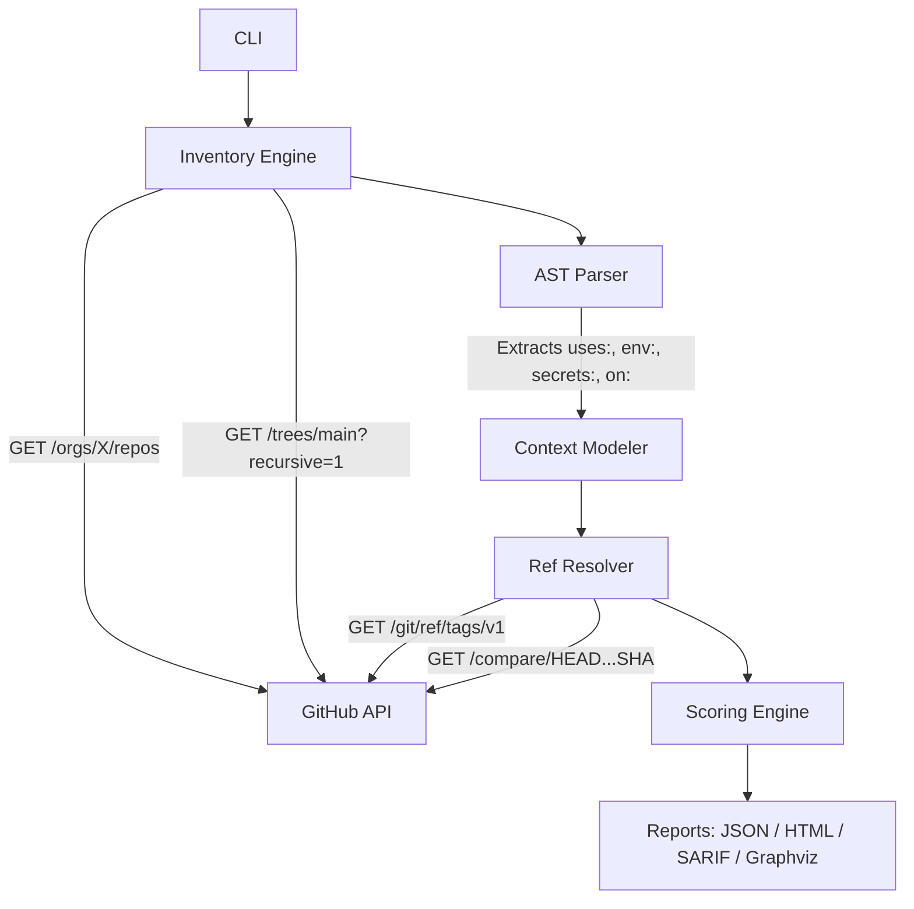

# ActionRadius 💥

> Fleet-wide exposure analysis for compromised GitHub Actions dependencies.

[](https://opensource.org/licenses/MIT)

## The Problem

On March 19, 2026, attackers hijacked **75 of 76 version tags** on `aquasecurity/trivy-action` — a security scanner used in thousands of CI pipelines — and used it to steal cloud credentials from downstream workflows. They also swapped a SHA pin in Trivy's own release workflow to point at an **orphan commit** in `actions/checkout`, leaving the `# v6.0.2` comment intact so reviewers wouldn't notice.

If you were a security lead that morning, your first question wasn't *"is our workflow YAML well-written"* (zizmor/poutine answer that). It was:

> **"Which of our repos actually pull this action, at what pin, triggered by what, with access to what secrets — right now?"**

Nobody's tooling answered that question in an hour. ActionRadius does.

---

## How It Works



ActionRadius connects directly to the GitHub API, inventories your entire organization's workflow files in seconds via the Git Trees API, resolves every mutable tag to its live SHA, evaluates the contextual risk (secrets, permissions, triggers), and outputs a ranked incident-response report with tri-state compromise classification: **COMPROMISED**, **SAFE**, or **UNKNOWN**.

---

## Features

| Feature | What it does |
|---|---|
| **Zero-Setup Inventory** | Git Trees API (`?recursive=1`) pulls workflows across hundreds of repos without hitting Code Search rate limits |
| **Live Ref Resolution** | Resolves mutable tags (`@v4`) to their exact 40-char SHAs in real-time |
| **Compromised Range Matching** | `--bad-from` / `--bad-to` checks if a resolved SHA falls inside a known-bad commit window via the Compare API |
| **Tri-State Classification** | Every finding is `COMPROMISED`, `SAFE`, or `UNKNOWN` — never silently treated as safe |
| **Orphan Commit Detection** | Flags hidden SHAs not on any branch (the exact technique from the Trivy binary attack) |
| **SHA/Comment Mismatch** | Detects when `@SHA # v6.0.2` claims a version tag the SHA doesn't actually match |
| **Context-Aware Scoring** | Evaluates triggers, permissions, secrets, and runner type alongside compromise status |
| **Curated Incident Feed** | `--target-feed` scans your org against every known-compromised action in one pass |
| **IOC Hunting** | Searches `run:` blocks for malicious domains (e.g., `aquasecurtiy.org`) |
| **SARIF / HTML / Graphviz** | Multiple report formats including GHAS-compatible SARIF and blast-radius graphs |

---

## Why Not Zizmor / Poutine?

Zizmor and Poutine are excellent tools for **per-workflow hygiene** — flagging `pull_request_target` with untrusted input, detecting taint in shell expressions, and linting YAML patterns.

ActionRadius solves a **different problem**: fleet-wide incident response. When `trivy-action@0.34.2` was compromised on March 19, zizmor could tell you "this workflow has a risky trigger pattern." It could not tell you:

- Which of your 500 repos currently resolve `trivy-action@0.34.2` to the **poisoned SHA** (`ddb9da44`)
- That the `actions/checkout` SHA pin in your release workflow is an **orphan commit** with a **spoofed version comment** (`# v6.0.2`)
- That the workflow leaking your AWS credentials has `secrets: inherit` + `pull_request_target` + a self-hosted runner

ActionRadius answers all three. It treats your CI/CD estate as a graph and ranks the blast radius.

---

## Quick Start

```bash
git clone https://github.com/Rajkumar3887/Actionradius.git
cd Actionradius
python -m venv venv
source venv/bin/activate  # Windows: .\venv\Scripts\activate
pip install -e .
export GITHUB_TOKEN="your_token_here"
```

### Incident Response Mode (Compromised Range)

```bash
# "Which repos are exposed to the Trivy compromise?"
actionradius scan \
  --org my-org \
  --target aquasecurity/trivy-action \
  --bad-from ddb9da44 \
  --bad-to 76d05ec629db6c6a67e5a1f8a6cbf069d1e4e1de
```

### Curated Feed Mode (All Known Incidents)

```bash
# "Show me my org's exposure to EVERY known-compromised action"
actionradius scan \
  --org my-org \
  --target-feed data/compromised_feed.json \
  --html report.html
```

### Legacy Safe-Ref Mode

```bash
# "Flag everything except this known-good SHA"
actionradius scan \
  --org my-org \
  --target actions/checkout \
  --safe-ref 8410ad0602e1e429cee44a835ae97775bbe51671
```

### IOC Hunting

```bash
# "Did any workflow pull from the typosquatted C2?"
actionradius scan \
  --org my-org \
  --ioc-search "aquasecurtiy.org"
```

---

## Report Output

Each finding answers the incident-response question directly:

```
[CRITICAL] [COMPROMISED] my-org/payment-api:.github/workflows/deploy.yml -> aquasecurity/trivy-action@0.34.2
  Resolved SHA: ddb9da44...
  Pin type: mutable_ref
  Rationale: Mutable pin exposed to compromised commit (+3), Fork-reachable trigger (+3), Inherited secrets (+3)
```

HTML reports split findings into three sections:
- 🚨 **Currently Compromised** — action resolves to a known-bad SHA right now
- ⚠️ **Unknown** — cannot confirm safe (API error, unresolvable ref)
- ✅ **Safe** — provably outside the compromised range

---

## Scoring Model

All weights are configurable via `data/weights.yaml`:

| Signal | Default Weight | Rationale |
|---|---|---|
| Orphan commit SHA | +8.0 | Hidden commit not on any branch — strong attack indicator |
| SHA pinned to compromised commit | +8.0 | Directly executing known-bad code |
| Mutable pin + compromised | +3.0 | Tag/branch currently points at bad commit |
| Unknown compromise status | +4.0 | Cannot confirm safe — don't assume it is |
| Fork-reachable trigger | +3.0 | `pull_request_target`, `workflow_run` from forks |
| `secrets: inherit` | +3.0 | All org secrets available to the action |
| Explicit secrets | +2.0 | Named secrets (AWS_KEY, NPM_TOKEN, etc.) |
| Self-hosted runner | +2.0 | Persistent infrastructure access |

Score → severity: `0-1` info, `2-4` medium, `5-7` high, `8+` critical.

---

## License

MIT — see [LICENSE](LICENSE).
