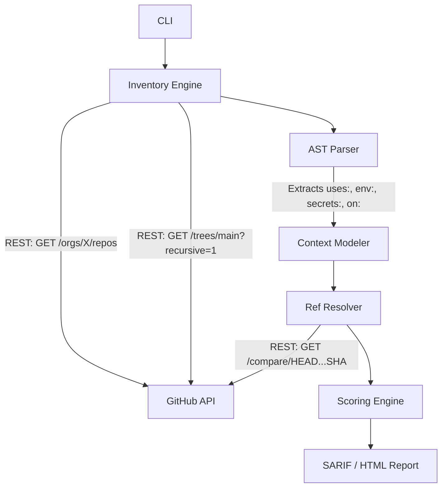

# ActionRadius 💥

> A lightning-fast, graph-aware GitHub Actions dependency blast-radius mapper.

[](https://opensource.org/licenses/MIT)

**The Scenario:** It's 9:00 AM. A major third-party GitHub Action (e.g., `aquasecurity/trivy-action` or `tj-actions/changed-files`) has just been compromised. Attackers are using it to exfiltrate AWS credentials from CI/CD pipelines.

**The Question:** Out of your organization's 500 repositories, which ones are actively vulnerable *right now*? 

Existing linting tools (like Zizmor or Poutine) tell you if a single file has a risky pattern. They do not tell you your fleet-wide exposure to a specific, compromised dependency. **ActionRadius does.**

ActionRadius connects directly to the GitHub API, parses your entire organization's workflow fleet in seconds, resolves mutable tags to their live SHAs, evaluates the contextual risk (secrets, permissions, triggers), and outputs a ranked Incident Response report.

---

## ⚡ Features
* **Zero-Setup Inventory:** Uses the GitHub Git Trees API (`?recursive=1`) to pull workflow files across hundreds of repos in seconds without hitting the strict Code Search API rate limits.
* **Live Ref Resolution:** Detects mutable tags (e.g. `@v4`) and resolves them to their exact 40-character SHAs in real-time to see if they point to the poisoned commit.
* **Context-Aware Scoring:** Evaluates workflow permissions, extracted secrets (`secrets: inherit`), and dangerous triggers (`pull_request_target`) to score the actual exploitability of the dependency.
* **Orphan Commit Detection:** Instantly flags hidden malicious SHAs that attackers have detached from the default branch.
* **IOC Hunting:** Can search raw bash scripts inside `run:` blocks across your organization for malicious payloads/domains.
* **GHAS Integration:** Natively exports SARIF reports for direct ingestion into the GitHub Advanced Security dashboard.

---

## 🛠️ Differentiation: Why not Zizmor / Poutine?
Zizmor and Poutine are phenomenal tools for **per-workflow hygiene** and taint analysis (e.g., "does this untrusted PR title get evaluated in a bash script?"). 

ActionRadius is built for **fleet-wide incident response**. When a popular dependency is compromised, you do not have time to run a static analysis linter against 500 repositories one-by-one. ActionRadius treats your CI/CD estate as a graph, finding exactly where the poisoned dependency lives and ranking the blast radius.

---

## 🚀 Installation & Usage

```bash
# Clone the repository
git clone https://github.com/yourusername/actionradius.git
cd actionradius

# Create a virtual environment and install dependencies
python -m venv venv
source venv/bin/activate  # On Windows: .\venv\Scripts\activate
pip install -e .
```

### Authentication
ActionRadius requires a GitHub Personal Access Token (Classic or Fine-Grained) to read repository data.
```bash
export GITHUB_TOKEN="github_pat_xxx..."
```

### Basic Usage (Incident Response)
Find all usages of `actions/checkout` in the `pallets` organization, assuming everything before a specific safe SHA is compromised:

```bash
python -m actionradius.cli \
  --org pallets \
  --target actions/checkout \
  --safe-ref 8410ad0602e1e429cee44a835ae97775bbe51671 \
  --html report.html
```

### Indicator of Compromise (IOC) Hunting
Hunt for a known malicious domain injected into inline `run:` scripts:

```bash
python -m actionradius.cli \
  --org pallets \
  --ioc-search "http://malicious-crypto-miner.com/install.sh"
```

## 🏗️ Architecture

